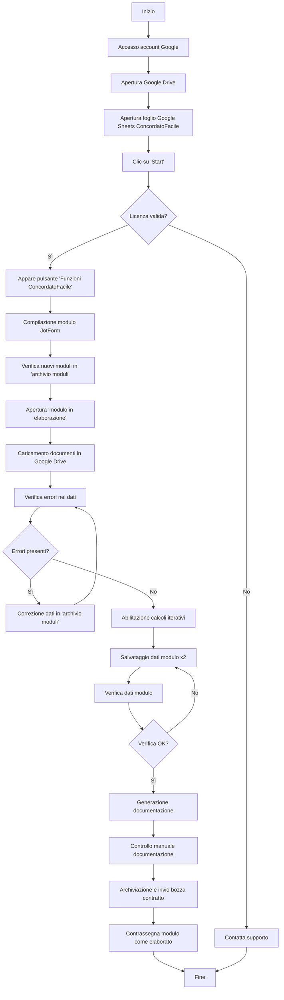

# Guida Utente ConcordatoFacile

## Indice
1. [Accesso e Navigazione Iniziale](#1-accesso-e-navigazione-iniziale)
2. [Avvio del Programma](#2-avvio-del-programma)
3. [Compilazione del Modulo JotForm](#3-compilazione-del-modulo-jotform)
4. [Gestione dei Moduli](#4-gestione-dei-moduli)
5. [Elaborazione dei Moduli](#5-elaborazione-dei-moduli)
6. [Gestione Anagrafiche](#6-gestione-anagrafiche)
7. [Calcoli e Salvataggio Dati](#7-calcoli-e-salvataggio-dati)
8. [Generazione e Verifica della Documentazione](#8-generazione-e-verifica-della-documentazione)
9. [Archiviazione e Invio del Contratto](#9-archiviazione-e-invio-del-contratto)
10. [Supporto Tecnico](#10-supporto-tecnico)

## Panoramica del Processo

Il seguente diagramma illustra il flusso di lavoro completo per l'elaborazione di un modulo in ConcordatoFacile:

Questo diagramma offre una visione d'insieme del processo, dall'accesso iniziale alla finalizzazione dell'elaborazione del modulo. Le sezioni successive dettagliano ogni fase del processo.

## 1. Accesso e Navigazione Iniziale

1.1. Accedere all'account Google di ConcordatoFacile utilizzando le credenziali fornite.

1.2. Aprire Google Drive dopo l'accesso.

1.3. Navigare in "Il mio drive" e aprire l'unica cartella presente, che contiene "ConcordatoFacile" nel titolo.

1.4. Individuare e aprire il documento Google Sheets con "concordatofacile" nel nome (icona verde).

## 2. Avvio del Programma

2.1. Nella schermata di Google Sheets, localizzare la barra degli strumenti (inizia con il pulsante "File" a sinistra).

2.2. Alla fine della barra degli strumenti, sulla destra, cliccare sul pulsante "Start".

2.3. Leggere attentamente l'avviso che apparirà e cliccare su "OK". Questo avvierà il controllo della licenza di ConcordatoFacile.

2.4. Se la licenza è valida e non scaduta, apparirà un nuovo pulsante "Funzioni ConcordatoFacile" a destra di "Start".

## 3. Compilazione del Modulo JotForm

3.1. Cliccare sul pulsante "Funzioni ConcordatoFacile" per visualizzare il menu con tutte le funzioni disponibili.

3.2. Selezionare "Link al modulo JotForm", il primo pulsante in alto nel menu.

3.3. Se il modulo non si apre, autorizzare l'apertura dei popup nel browser. In caso di difficoltà, contattare il supporto tecnico all'indirizzo germ.riccio@gmail.com.

3.4. Compilare personalmente il modulo o inviarlo ai locatori/inquilini/agenti immobiliari per la compilazione.

## 4. Gestione dei Moduli

4.1. Dopo la compilazione del modulo JotForm, tornare al file Google Sheets e aprire il foglio "archivio moduli".

4.2. In questo foglio, ogni riga rappresenta un modulo JotForm compilato, con le informazioni archiviate orizzontalmente.

4.3. I nuovi moduli compilati appariranno come righe aggiuntive nel foglio "archivio moduli".

4.4. Identificare i moduli non elaborati controllando la prima colonna (header "elaborati"): se c'è scritto "si", il modulo è stato elaborato.

## 5. Elaborazione dei Moduli

5.1. Per elaborare i moduli non processati, passare al foglio "modulo in elaborazione".

5.2. Qui verrà visualizzato il modulo non elaborato più vecchio.

5.3. Aprire il menu "Funzioni ConcordatoFacile" e cliccare su "carica documenti in Google Drive" per archiviare i documenti inviati tramite JotForm.

5.4. Le colonne gialle nel foglio "modulo in elaborazione" evidenzieranno eventuali problemi con i dati inviati.

5.5. Per modificare i dati, tornare al foglio "archivio moduli", individuare la riga corrispondente al modulo in elaborazione e modificare direttamente le celle pertinenti.

ATTENZIONE: Modificare i dati SOLO nel foglio "archivio moduli". Intervenire su altri fogli potrebbe compromettere il funzionamento del programma.

## 6. Gestione Anagrafiche

6.1. Nel foglio "modulo in elaborazione", una dashboard mostrerà il numero di errori nei dati JotForm.

6.2. Le richieste da membri non iscritti all'associazione verranno conteggiate come errori.

6.3. Per risolvere:
   - Andare al foglio "gestione anagrafiche"
   - Aprire il menu "Funzioni ConcordatoFacile"
   - Selezionare "Nuova iscrizione"
   - Inserire la data di iscrizione all'associazione nella cella sotto l'header arancione

6.4. Tornare al foglio "modulo in elaborazione". La dashboard degli errori dovrebbe ora indicare 0.

## 7. Calcoli e Salvataggio Dati

7.1. Abilitare i calcoli iterativi:
   - Cliccare su "File" nella barra degli strumenti
   - Selezionare "Impostazioni"
   - Andare alla scheda "Calcolo"
   - Attivare "Calcoli iterativi"

7.2. Nel foglio "modulo in elaborazione", controllare il pannello dello stato dei calcoli.

7.3. Quando la cella sotto "⬇️ Salvare i dati del modulo?" contiene "si":
   - Aprire il menu "Funzioni ConcordatoFacile"
   - Selezionare "Salva dati modulo"
   - Ripetere questa operazione due volte (circa 30 secondi ciascuna)

Nota: Chiudere manualmente la finestra di progresso se non si chiude automaticamente.

## 8. Generazione e Verifica della Documentazione

8.1. Dopo aver salvato il modulo due volte, cliccare su "Verifica dati modulo".

8.2. Se non ci sono errori, procedere con la generazione della documentazione:
   - Aprire il menu "Funzioni ConcordatoFacile"
   - Selezionare "Genera contratto"
   - Attendere la conferma di generazione corretta
   - Cliccare sul link fornito per visualizzare la documentazione generata

8.3. Controllare attentamente il file generato e apportare eventuali modifiche necessarie.

IMPORTANTE: Non saltare questo passaggio di controllo umano!

## 9. Archiviazione e Invio del Contratto

9.1. Dopo la verifica, tornare al file Google Sheets.

9.2. Andare al foglio "gestione contratti e comunicazioni".

9.3. Aprire il menu "Funzioni ConcordatoFacile" e selezionare "Archivia e invia bozza contratto".

9.4. Il contratto verrà archiviato in Google Drive con l'opzione di inviarlo automaticamente al membro richiedente.

9.5. Tornare al foglio "archivio moduli" e contrassegnare il modulo come elaborato scrivendo "si" nella prima colonna.

## 10. Supporto Tecnico

Per qualsiasi problema o chiarimento, contattare:
- Email: germ.riccio@gmail.com
- Telefono: 3313815525

Nota: Questa guida è soggetta a aggiornamenti continui. Verificare periodicamente eventuali nuove versioni o modifiche.
