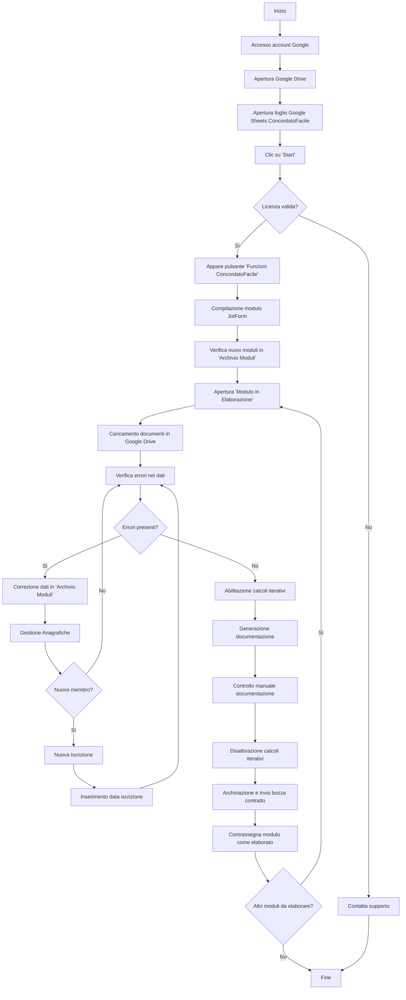

# ConcordatoFacile: Guida utente

## Indice
1. [Introduzione](#1-introduzione)
2. [Prerequisiti](#2-prerequisiti)
3. [Accesso e Navigazione Iniziale](#3-accesso-e-navigazione-iniziale)
4. [Utilizzo del Modulo JotForm](#4-utilizzo-del-modulo-jotform)
5. [Gestione dei Dati nel Foglio "Archivio Moduli"](#5-gestione-dei-dati-nel-foglio-archivio-moduli)
6. [Elaborazione dei Moduli](#6-elaborazione-dei-moduli)
7. [Gestione delle Anagrafiche](#7-gestione-delle-anagrafiche)
8. [Configurazione dei Calcoli Iterativi](#8-configurazione-dei-calcoli-iterativi)
9. [Salvataggio e Verifica dei Dati del Modulo](#9-salvataggio-e-verifica-dei-dati-del-modulo)
10. [Generazione e Gestione della Documentazione](#10-generazione-e-gestione-della-documentazione)
11. [Archiviazione e Invio della Bozza del Contratto](#11-archiviazione-e-invio-della-bozza-del-contratto)
12. [Finalizzazione del Processo](#12-finalizzazione-del-processo)
13. [Diagramma di Flusso](#13-diagramma-di-flusso)
14. [Modifica di un Contratto dopo l'Elaborazione](#14-modifica-di-un-contratto-dopo-lelaborazione)
15. [Supporto e Contatti](#15-supporto-e-contatti)

## 1. Introduzione

Benvenuti alla guida utente di ConcordatoFacile, un sistema per la gestione e l'elaborazione di contratti di locazione a canone concordato. Questo documento fornisce istruzioni passo-passo per utilizzare efficacemente il sistema, dalla raccolta dei dati iniziali attraverso JotForm fino alla generazione e all'archiviazione dei documenti finali.

ConcordatoFacile è stato progettato per semplificare ogni fase del processo di creazione dei contratti, riducendo al minimo l'intervento manuale. Tuttavia, l'uso del sistema **non garantisce la correttezza, la completezza o la conformità legale** dei documenti prodotti. La responsabilità del **controllo finale dei documenti generati** e della loro conformità alle normative vigenti ricade **esclusivamente sull’utilizzatore del sistema**. Nessuna responsabilità può essere attribuita per **errori, omissioni o incongruenze** nei documenti, né per il mancato rispetto di leggi o regolamenti. **Non si forniscono garanzie legali o di altro tipo** riguardo all'utilizzo del sistema e agli output da esso prodotti.

## 2. Prerequisiti

Prima di iniziare a utilizzare ConcordatoFacile, assicurarsi di avere:

- Accesso all'account Google di ConcordatoFacile (le credenziali saranno fornite separatamente)
- Un browser web aggiornato (preferibilmente Google Chrome)
- Familiarità di base con Google Drive e Google Sheets
- **Una connessione internet stabile**: si consiglia una velocità minima di 30 Mbps. Connessioni lente o instabili possono causare problemi di sincronizzazione, come errori nei calcoli, mancati aggiornamenti dei dati o fallimento nel salvataggio delle modifiche apportate ai documenti.

## 3. Accesso e Navigazione Iniziale

1. **Accesso all'account Google:**
   - Utilizzare le credenziali fornite per accedere all'account Google di ConcordatoFacile.
   - In caso di problemi di accesso, contattare immediatamente il supporto tecnico.

2. **Navigazione su Google Drive:**
   - Una volta effettuato l'accesso, aprire Google Drive dal menu delle applicazioni Google.
   - Nella sezione "Il mio Drive", individuare la cartella denominata "ConcordatoFacile".
   - Aprire questa cartella per accedere ai file del sistema.

3. **Apertura del foglio di lavoro principale:**
   - All'interno della cartella ConcordatoFacile, cercare il file Google Sheets con "concordatofacile" nel nome (identificabile dall'icona verde caratteristica di Google Sheets).
   - Aprire questo file facendo doppio clic sul suo nome.

4. **Interfaccia del foglio di lavoro:**
   - Una volta aperto il file, si presenterà l'interfaccia standard di Google Sheets.
   - Familiarizzare con la barra degli strumenti nella parte superiore, che inizia con il menu "File" a sinistra.

5. **Attivazione delle funzionalità di ConcordatoFacile:**
   - Fare clic su **"Start"** nella barra degli strumenti e selezionare **"Verifica Licenza"**.
   - Leggere l'avviso e fare clic su **"OK"**.
   - Se la licenza è valida, apparirà il pulsante **"Funzioni ConcordatoFacile"** accanto a **"Start"**.

## 4. Utilizzo del Modulo JotForm

1. **Accesso al modulo JotForm:**
   - Nel menu "Funzioni ConcordatoFacile", cliccare sul primo pulsante in alto denominato "Link al modulo JotForm".
   - Se il modulo non si apre automaticamente, potrebbe essere necessario autorizzare l'apertura dei popup nel browser.

2. **Compilazione del modulo:**
   - Il modulo può essere compilato direttamente dall'operatore o inviato a locatori, inquilini o agenti immobiliari per la compilazione.
   - Assicurarsi che tutte le informazioni richieste siano inserite accuratamente.

3. **Risoluzione dei problemi di apertura:**
   - Se si verificano problemi nell'apertura del modulo, verificare le impostazioni del browser relative ai popup.
   - Per assistenza tecnica, contattare il supporto all'indirizzo germ.riccio@gmail.com.

## 5. Gestione dei Dati nel Foglio "Archivio Moduli"

1. **Navigazione al foglio "Archivio Moduli":**
   - Una volta compilato il modulo JotForm, tornare al file Google Sheets e selezionare il foglio "Archivio Moduli" dalla barra in basso.

2. **Struttura del foglio "Archivio Moduli":**
   - In questo foglio, le informazioni raccolte tramite i moduli JotForm sono archiviate orizzontalmente.
   - Ogni riga corrisponde a un singolo modulo JotForm compilato.
   - Le nuove compilazioni del modulo JotForm creano automaticamente nuove righe in questo foglio.

3. **Identificazione dei moduli non elaborati:**
   - La prima colonna del foglio, con l'header "Elaborati", indica lo stato di elaborazione di ogni modulo.
   - Se in una cella sotto "Elaborati" è presente "Sì", il modulo corrispondente è stato elaborato.
   - Le celle vuote in questa colonna indicano moduli non ancora elaborati.

4. **Importanza dell'integrità dei dati:**
   - Tutte le modifiche ai dati devono essere effettuate **esclusivamente** nel foglio "Archivio Moduli".
   - È fondamentale non modificare manualmente i dati in altri fogli del file, poiché ciò **potrebbe compromettere il funzionamento del sistema**.
   - **Non modificare l'ordine delle colonne:** L'ordine delle colonne nel foglio "Archivio Moduli" è critico per il corretto funzionamento di ConcordatoFacile. Se si nota che l'ordine delle colonne è stato accidentalmente modificato, **contattare immediatamente il supporto tecnico** prima di procedere con qualsiasi altra operazione.

## 6. Elaborazione dei Moduli

1. **Accesso al foglio "Modulo in Elaborazione":**
   - Passare al foglio "Modulo in Elaborazione" per iniziare il processo di elaborazione.
   - Questo foglio visualizzerà automaticamente il modulo non elaborato più vecchio.

2. **Caricamento dei documenti:**
   - Nel menu "Funzioni ConcordatoFacile", selezionare "Carica allegati in Google Drive".
   - Questa operazione caricherà tutti gli allegati inviati tramite JotForm nell'archivio di ConcordatoFacile.

3. **Verifica e correzione dei dati:**
   - Nel foglio "Modulo in Elaborazione", le colonne gialle evidenziano eventuali problemi con i dati inviati.
   - Per correggere questi dati, tornare al foglio "Archivio Moduli".
   - Individuare la riga corrispondente al modulo in elaborazione.
   - Apportare le modifiche necessarie direttamente nelle celle appropriate del foglio "Archivio Moduli".
   
   **Problema noto:** I nomi delle colonne nel foglio "Archivio Moduli" potrebbero non corrispondere esattamente ai dati visualizzati nelle righe. Per individuare il campo specifico che si desidera modificare, si consiglia di:
   - **Identificare la riga** su cui si sta lavorando.
   - Utilizzare la funzione "Trova" (**Ctrl+F**) per **cercare direttamente il contenuto** che si intende correggere all'interno della riga selezionata.
   - **Non fare affidamento sui nomi delle colonne** per individuare la cella, ma utilizzare la ricerca per contenuto come descritto sopra.
  
5. **Gestione dei caratteri speciali nei campi di testo:**
   - Prestare particolare attenzione ai campi di testo che contengono apostrofi o altri caratteri speciali.
   - In alcuni casi, specialmente quando il modulo JotForm viene compilato da dispositivi mobili, possono essere inseriti caratteri non standard (come ` invece di ').
   - Questi caratteri non standard possono causare errori nell'elaborazione dei dati o nella generazione dei codici fiscali.
   - Se si notano problemi con l'elaborazione dei dati o con i codici fiscali, controllare e correggere manualmente i campi di testo nel foglio "Archivio Moduli".
   - Esempio: Se "Sant'Antimo" appare come "Sant\`Antimo", sostituire il carattere ` con un apostrofo standard (').

6. **Dashboard errori:**
   - Nel foglio "Modulo in Elaborazione" è presente una dashboard che mostra il numero di errori nei dati.
   - Prestare attenzione a questa dashboard per garantire la corretta elaborazione del modulo.

## 7. Gestione delle Anagrafiche

1. **Gestione dei membri non iscritti:**
   - Le richieste provenienti da membri non ancora iscritti all'associazione vengono conteggiate come errori.
   - Per risolvere questo problema, seguire i passaggi seguenti.

2. **Iscrizione di nuovi membri:**
   - Navigare al foglio "Gestione Anagrafiche".
   - Aprire il menu "Funzioni ConcordatoFacile" e selezionare "Nuova Iscrizione".
   - Il sistema inserirà automaticamente i dati del nuovo membro nel database delle anagrafiche.

3. **Inserimento della data di iscrizione:**
   - Nella riga del nuovo membro, individuare la colonna con l'header arancione che richiede la data di iscrizione.
   - Inserire manualmente la data di iscrizione all'associazione nella cella corrispondente.

4. **Verifica della risoluzione degli errori:**
   - Tornare al foglio "Modulo in Elaborazione".
   - Controllare la dashboard degli errori: dovrebbe ora indicare zero errori.
   - Se persistono errori, ricontrollare i dati inseriti e ripetere il processo se necessario.

## 8. Configurazione dei Calcoli Iterativi

1. **Accesso alle impostazioni di calcolo:**
   - Nella barra degli strumenti, cliccare su "File".
   - Selezionare "Impostazioni" o "Settings" dal menu a tendina.

2. **Attivazione dei calcoli iterativi:**
   - Nella finestra delle impostazioni, selezionare la scheda "Calcolo" o "Calculations".
   - Individuare l'opzione "Calcoli iterativi" o "Iterative calculations".
   - Attivare questa opzione per consentire a ConcordatoFacile di eseguire i calcoli necessari.

3. **Importanza dei calcoli iterativi:**
   - Questa impostazione è cruciale per l'applicazione corretta di eventuali maggiorazioni o riduzioni previste dall'accordo territoriale del comune in cui è ubicato l'immobile.

## 9. Salvataggio e Verifica dei Dati del Modulo

1. **Verifica dello stato di salvataggio:**
   - Nel foglio "Modulo in Elaborazione", individuare il pannello che indica lo stato dei calcoli in corso.
   - Cercare la voce "⬇️ Salvare i dati del modulo?".

2. **Procedura di salvataggio:**
   - Quando la cella sotto questa voce contiene "Sì", procedere con il salvataggio.
   - Aprire il menu "Funzioni ConcordatoFacile" e selezionare "Salva e verifica dati".
   - Il processo richiede circa 30 secondi.
   - In assenza di errori, si può procedere alla generazione della documentazione.

## 10. Generazione e Gestione della Documentazione

1. **Avvio della generazione dei documenti:**
   - Nel menu "Funzioni ConcordatoFacile", selezionare "Genera contratto".
   - Attendere alcuni secondi per il completamento del processo.

2. **Conferma di generazione:**
   - Apparirà una finestra di conferma che indica la corretta generazione del contratto.
   - Questa finestra conterrà un link per visualizzare immediatamente la documentazione generata.

3. **Revisione della documentazione:**
   - Cliccare sul link fornito per esaminare i documenti generati.
   - Controllare attentamente tutti gli elementi della documentazione, inclusi:
     - Scheda riepilogativa
     - Asseverazione
     - Contratto
     - Ricevuta
     - Modulo di iscrizione (se applicabile)
   
   **Problema noto:** Occasionalmente, a causa di problemi di sincronizzazione legati alla connessione del dispositivo o alla natura stessa di Google Sheets, i calcoli o il testo del contratto generato potrebbero non corrispondere a quanto visualizzato nell'interfaccia del foglio di calcolo "Modulo in elaborazione". In tal caso, è sufficiente eliminare i documenti e il contratto contenenti i dati non corretti e ripetere la procedura di salvataggio e verifica dati del modulo per aggiornare le informazioni e generare una versione corretta del contratto.

4. **Modifiche manuali:**
   - Se necessario, apportare modifiche ai documenti generati.
   - Prestare particolare attenzione a dettagli specifici che potrebbero richiedere personalizzazione.
  
5. **Disattivazione dei calcoli iterativi:**
   - Dopo aver generato e controllato tutti i documenti, è importante disattivare i calcoli iterativi.
   - Tornare alla barra degli strumenti di Google Sheets e cliccare su "File".
   - Selezionare nuovamente "Impostazioni" o "Settings".
   - Nella scheda "Calcolo" o "Calculations", disattivare l'opzione "Calcoli iterativi" o "Iterative calculations".
   - Questa azione è cruciale per evitare rallentamenti nel foglio di calcolo durante le successive operazioni.

## 11. Archiviazione e Invio della Bozza del Contratto

1. **Navigazione al foglio di gestione:**
   - Tornare al file Google Sheets principale.
   - Selezionare il foglio "Gestione contratti e comunicazioni".

2. **Processo di archiviazione:**
   - Aprire il menu "Funzioni ConcordatoFacile".
   - Selezionare l'opzione "Archivia e invia bozza contratto".
   - Questa azione archivierà automaticamente il contratto in Google Drive.

3. **Opzioni di invio:**
   - Durante il processo di archiviazione, sarà possibile scegliere se inviare automaticamente i documenti al membro dell'associazione che li ha richiesti.
   - Seguire le istruzioni a schermo per completare l'invio, se desiderato.

## 12. Finalizzazione del Processo

1. **Ritorno al foglio "Archivio Moduli":**
   - Navigare nuovamente al foglio "Archivio Moduli".

2. **Marcatura del modulo come elaborato:**
   - Individuare la riga corrispondente al modulo appena elaborato.
   - Nella prima colonna (header "Elaborato"), inserire "Sì" nella cella corrispondente.

3. **Effetti dell'azione:**
   - Questa operazione escluderà il modulo dalla coda di elaborazione.
   - Il sistema caricherà automaticamente il prossimo modulo non elaborato, se presente.

## 13. Diagramma di Flusso

## 14. Modifica di un Contratto dopo l'Elaborazione

In alcune situazioni, potrebbe essere necessario apportare modifiche a un contratto già elaborato. Di seguito sono riportati i passaggi per modificare un contratto generato e riportarlo nel flusso di elaborazione:

1. **Localizzazione del contratto in Google Drive:**
   - Utilizzare la funzione di ricerca avanzata di Google Drive per trovare il file del contratto.
   - Nota: Per dettagli sull'uso della ricerca avanzata, contattare il supporto tecnico.

2. **Apertura del contratto:**
   - Una volta individuato il file, aprirlo in Google Drive.

3. **Identificazione dell'ID del file:**
   - Nell'URL del documento aperto, individuare e copiare l'ID del file.

4. **Accesso al foglio di gestione:**
   - Aprire il foglio di calcolo 'Gestione contratti e comunicazioni'.

5. **Localizzazione della riga del contratto:**
   - Utilizzare la combinazione Ctrl+F (o Cmd+F su Mac) per cercare l'ID precedentemente copiato.
   - Questo permetterà di trovare la riga corrispondente al contratto da modificare.

6. **Identificazione del Submission ID:**
   - Nella riga individuata, cercare la colonna che contiene il Submission ID per questo contratto.
   - Copiare il Submission ID.

7. **Ricerca nel foglio 'Archivio moduli':**
   - Passare al foglio 'Archivio moduli'.
   - Usare nuovamente Ctrl+F (o Cmd+F) per cercare il Submission ID copiato.

8. **Rimozione del flag di elaborazione:**
   - Una volta trovata la riga corrispondente, individuare la colonna A.
   - Eliminare il "Sì" presente in questa colonna, che indica che il modulo è stato elaborato.

9. **Rielaborazione del modulo:**
   - Con la rimozione del "Sì", il modulo tornerà in coda per l'elaborazione.
   - Procedere con una nuova elaborazione del modulo, correggendo i dati che hanno reso necessaria la modifica.

10. **Gestione del nuovo contratto generato:**
    - Dopo la generazione del nuovo contratto, non utilizzare la funzione 'Archivia e invia bozza contratto'.
    - Invece, copiare l'URL del nuovo contratto generato.

11. **Aggiornamento del link nel foglio di gestione:**
    - Tornare al foglio 'Gestione contratti e comunicazioni'.
    - Nella riga del contratto originale (identificata al punto 5), sostituire il vecchio URL con quello del nuovo contratto nella colonna H.

12. **Pulizia di Google Drive:**
    - Eliminare il file del vecchio contratto da Google Drive per evitare confusioni future.

Seguendo questi passaggi, è possibile modificare un contratto già elaborato e assicurarsi che il nuovo documento sostituisca correttamente quello precedente nel sistema.

## 15. Supporto e Contatti

Questa guida rappresenta una panoramica del processo di utilizzo di ConcordatoFacile, ma non è da considerarsi esaustiva o definitiva. Il sistema è in continua evoluzione e potrebbe subire modifiche nel tempo. Per qualsiasi problema o chiarimento, si prega di contattare il supporto tecnico all'indirizzo germ.riccio@gmail.com o telefonicamente al numero 3313815525.
