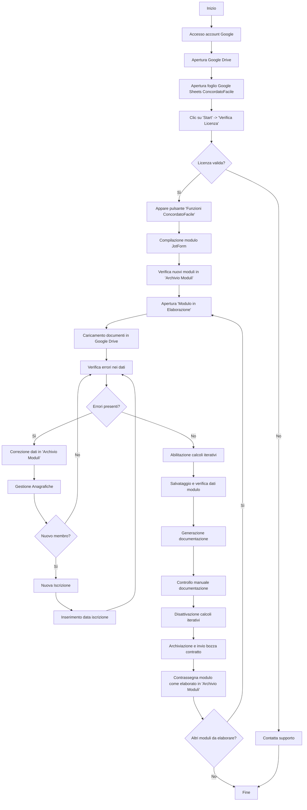

# ConcordatoFacile: Guida Operativa per la Gestione dei Contratti di Locazione

## Indice

1. [Introduzione](#1-introduzione)
2. [Requisiti di Sistema](#2-requisiti-di-sistema)
3. [Accesso e Configurazione Iniziale](#3-accesso-e-configurazione-iniziale)
4. [Raccolta Dati tramite Modulo JotForm](#4-raccolta-dati-tramite-modulo-jotform)
5. [Gestione Dati nel Foglio "Archivio Moduli"](#5-gestione-dati-nel-foglio-archivio-moduli)
6. [Elaborazione Modulo: Caricamento, Verifica e Correzione Dati](#6-elaborazione-modulo-caricamento-verifica-e-correzione-dati)
7. [Gestione Anagrafiche e Iscrizione Nuovi Membri](#7-gestione-anagrafiche-e-iscrizione-nuovi-membri)
8. [Configurazione Calcoli Iterativi per Maggiorazioni/Riduzioni](#8-configurazione-calcoli-iterativi-per-maggiorazioni/riduzioni)
9. [Salvataggio e Verifica Dati del Modulo](#9-salvataggio-e-verifica-dati-del-modulo)
10. [Generazione, Revisione e Modifica Documentazione](#10-generazione-revisione-e-modifica-documentazione)
11. [Archiviazione, Invio Bozza e Finalizzazione del Processo](#11-archiviazione-invio-bozza-e-finalizzazione-del-processo)
12. [Diagramma di Flusso del Processo](#12-diagramma-di-flusso-del-processo)
13. [Procedura di Modifica di un Contratto Elaborato](#13-procedura-di-modifica-di-un-contratto-elaborato)
14. [Supporto Tecnico e Contatti](#14-supporto-tecnico-e-contatti)

## 1. Introduzione

Benvenuti nella guida operativa di **ConcordatoFacile**, un sistema progettato per semplificare la gestione e l'elaborazione dei contratti di locazione a canone concordato. Questo manuale fornisce istruzioni dettagliate per utilizzare tutte le funzionalità del sistema, a partire dalla raccolta dei dati tramite il modulo JotForm, fino alla generazione, archiviazione e invio dei documenti finali.

**Disclaimer Importante:** ConcordatoFacile è uno strumento di supporto e, come tale, **non garantisce la correttezza, la completezza o la conformità legale** dei documenti prodotti. L'utente è **esclusivamente responsabile** della **verifica finale** dei documenti generati, del loro allineamento alle specifiche esigenze e della loro conformità alle normative vigenti. **Non si assume alcuna responsabilità** per errori, omissioni, incongruenze nei documenti o per la non conformità a leggi o regolamenti. **Non si forniscono garanzie**, esplicite o implicite, sull'utilizzo del sistema e sui documenti generati.

## 2. Requisiti di Sistema

Prima di utilizzare ConcordatoFacile, assicurarsi di disporre dei seguenti requisiti:

*   **Credenziali di Accesso:** Accesso all'account Google di ConcordatoFacile (fornite separatamente).
*   **Browser Web:** Un browser web aggiornato (Google Chrome è consigliato per una migliore compatibilità).
*   **Conoscenze di Base:** Familiarità con l'utilizzo di Google Drive e Fogli Google.
*   **Connessione Internet Stabile:** Una connessione internet stabile con una velocità minima consigliata di 30 Mbps. **Connessioni lente o instabili possono compromettere la sincronizzazione dei dati, causando errori nei calcoli, mancati aggiornamenti o problemi nel salvataggio delle modifiche.**

## 3. Accesso e Configurazione Iniziale

Seguire attentamente questi passaggi per accedere e configurare correttamente il sistema:

1. **Accesso all'Account Google:**
    *   Utilizzando le credenziali fornite, accedere all'account Google di ConcordatoFacile.
    *   **In caso di difficoltà di accesso, contattare immediatamente il supporto tecnico.**

2. **Navigazione in Google Drive:**
    *   Dopo aver effettuato l'accesso, aprire Google Drive dal menu delle applicazioni Google (icona a griglia di nove punti).
    *   Nella sezione "Il mio Drive", individuare e aprire la cartella denominata "ConcordatoFacile".

3. **Apertura del Foglio di Lavoro Principale:**
    *   All'interno della cartella "ConcordatoFacile", individuare il file Fogli Google con "concordatofacile" nel nome (icona verde di Fogli Google).
    *   Aprire il file facendo doppio clic sul nome.

4. **Interfaccia Utente:**
    *   Il file si aprirà nell'interfaccia standard di Fogli Google.
    *   Familiarizzare con la barra degli strumenti superiore, che include il menu "File" a sinistra e le icone delle funzioni standard.

5. **Attivazione delle Funzionalità di ConcordatoFacile:**
    *   Cliccare sul pulsante **"Start"** nella barra degli strumenti e selezionare **"Verifica Licenza"**.
    *   Leggere attentamente l'avviso e cliccare su **"OK"**.
    *   Se la licenza è attiva, apparirà il pulsante **"Funzioni ConcordatoFacile"** accanto al pulsante **"Start"**. Questo pulsante darà accesso a tutte le funzioni specifiche del sistema.

## 4. Raccolta Dati tramite Modulo JotForm

Il modulo JotForm è lo strumento principale per la raccolta dei dati necessari alla creazione dei contratti.

1. **Accesso al Modulo JotForm:**
    *   Cliccare sul pulsante "Funzioni ConcordatoFacile" nella barra degli strumenti.
    *   Selezionare il primo pulsante in alto, denominato "Link al modulo JotForm".
    *   Il modulo si aprirà in una nuova finestra del browser. **Se il modulo non si apre, verificare le impostazioni del browser relative ai popup e autorizzare l'apertura di finestre popup da questo sito.**

2. **Compilazione del Modulo:**
    *   Il modulo può essere compilato direttamente dall'operatore o inviato a terzi (privati, studi legali, CAF, agenzie immobiliari, ecc.) per la compilazione.
    *   **Compilare tutti i campi del modulo con attenzione e precisione.** Ogni campo è essenziale per la corretta elaborazione del contratto.
    *   **Attenzione ai Nomi dei Comuni con Accenti:** Per i comuni con nomi accentati (es. Ciriè), inserire il nome senza l'accento, sostituendolo con un apostrofo (es. Cirie'). **Questo è cruciale per il corretto funzionamento del sistema.** Se l'errore non viene rilevato in questa fase, è comunque possibile correggerlo successivamente nel foglio "Archivio Moduli".

3. **Risoluzione Problemi di Apertura:**
    *   In caso di problemi persistenti nell'apertura del modulo, contattare il supporto tecnico all'indirizzo email fornito nella sezione "Supporto Tecnico e Contatti".

## 5. Gestione Dati nel Foglio "Archivio Moduli"

Il foglio "Archivio Moduli" è il database centrale dove vengono memorizzati tutti i dati raccolti tramite i moduli JotForm.

1. **Accesso al Foglio "Archivio Moduli":**
    *   Dopo aver compilato e inviato un modulo JotForm, tornare al foglio di lavoro principale di ConcordatoFacile.
    *   Nella barra di navigazione inferiore, selezionare il foglio denominato "Archivio Moduli".

2. **Struttura del Foglio "Archivio Moduli":**
    *   I dati sono organizzati in righe e colonne.
    *   **Ogni riga corrisponde a un singolo modulo JotForm compilato.**
    *   Ogni colonna rappresenta un campo specifico del modulo JotForm.
    *   **Le nuove compilazioni del modulo JotForm aggiungono automaticamente nuove righe in fondo al foglio.**

3. **Identificazione dei Moduli Elaborati e Non Elaborati:**
    *   La prima colonna, denominata "Elaborati", indica lo stato di elaborazione di ogni modulo.
    *   Una cella con "Sì" indica che il modulo è stato elaborato.
    *   **Una cella vuota indica che il modulo non è ancora stato elaborato.**

4. **Regole Fondamentali per la Modifica dei Dati:**
    *   **Tutte le modifiche ai dati DEVONO essere effettuate ESCLUSIVAMENTE nel foglio "Archivio Moduli".**
    *   **NON modificare i dati in altri fogli del file.** Questo potrebbe compromettere il corretto funzionamento del sistema e causare errori irreversibili.
    *   **NON modificare l'ordine delle colonne nel foglio "Archivio Moduli".** L'ordine delle colonne è fondamentale per il funzionamento di ConcordatoFacile. **Se si rileva una modifica accidentale nell'ordine delle colonne, contattare immediatamente il supporto tecnico PRIMA di eseguire qualsiasi altra operazione.**

## 6. Elaborazione Modulo: Caricamento, Verifica e Correzione Dati

Questa sezione descrive il processo di elaborazione di un singolo modulo, dalla verifica dei dati alla loro correzione.

1. **Accesso al Foglio "Modulo in Elaborazione":**
    *   Nella barra di navigazione inferiore, selezionare il foglio denominato "Modulo in Elaborazione".
    *   **Questo foglio visualizzerà automaticamente i dati del modulo non elaborato più vecchio presente nel foglio "Archivio Moduli".**

2. **Caricamento degli Allegati in Google Drive:**
    *   Cliccare su "Funzioni ConcordatoFacile".
    *   Selezionare l'opzione "Carica allegati in Google Drive".
    *   Questa operazione caricherà tutti gli allegati inviati tramite il modulo JotForm nella cartella "ConcordatoFacile" in Google Drive, organizzandoli in sotto-cartelle per una gestione ottimale.

3. **Verifica e Correzione dei Dati:**
    *   Nel foglio "Modulo in Elaborazione", le celle evidenziate in giallo indicano potenziali errori o dati mancanti.
    *   **Per correggere questi dati, è necessario tornare al foglio "Archivio Moduli".**
    *   Individuare la riga corrispondente al modulo in elaborazione (la riga con la cella vuota nella colonna "Elaborati").
    *   Apportare le modifiche necessarie direttamente nelle celle corrispondenti del foglio "Archivio Moduli".

    **Importante - Individuazione Corretta dei Campi da Modificare nel Foglio "Archivio Moduli":**
    *   A causa di possibili discrepanze tra i nomi delle colonne nel foglio "Archivio Moduli" e i dati visualizzati, **si consiglia vivamente di NON affidarsi ai nomi delle colonne per individuare il campo da modificare.**
    *   Utilizzare invece la funzione di ricerca (**Ctrl+F** in Windows/Linux o **Cmd+F** in macOS) per **cercare direttamente il CONTENUTO del campo che si desidera correggere all'interno della riga selezionata.**
    *   Ad esempio, se si desidera correggere il cognome "Rossi" in "Bianchi", cercare "Rossi" all'interno della riga con Ctrl+F e apportare la modifica nella cella individuata.

4. **Gestione dei Caratteri Speciali:**
    *   Prestare particolare attenzione ai campi di testo che potrebbero contenere caratteri speciali, come apostrofi non standard (` invece di ') inseriti da dispositivi mobili.
    *   Questi caratteri possono generare errori nell'elaborazione dei dati o nella generazione dei codici fiscali.
    *   **Se si riscontrano problemi con codici fiscali o elaborazione dati, controllare attentamente i campi di testo nel foglio "Archivio Moduli" e sostituire i caratteri non standard con quelli corretti.**
    *   Esempio: Se "Sant'Antimo" viene visualizzato come "Sant\`Antimo", sostituire il carattere ` con un apostrofo standard (').

5. **Dashboard Errori:**
    *   Il foglio "Modulo in Elaborazione" include una dashboard che mostra il numero di errori rilevati.
    *   **Monitorare attentamente questa dashboard durante la fase di correzione per assicurarsi che tutti gli errori siano stati risolti.**

## 7. Gestione Anagrafiche e Iscrizione Nuovi Membri

Questa sezione spiega come gestire le anagrafiche dei membri e come iscrivere nuovi membri all'associazione.

1. **Gestione dei Membri Non Iscritti:**
    *   Le richieste provenienti da membri non ancora iscritti all'associazione vengono segnalate come errori nella dashboard del foglio "Modulo in Elaborazione".
    *   Per risolvere questi errori, è necessario iscrivere i nuovi membri.

2. **Procedura di Iscrizione di un Nuovo Membro:**
    *   Nella barra di navigazione inferiore, selezionare il foglio denominato "Gestione Anagrafiche".
    *   Cliccare su "Funzioni ConcordatoFacile".
    *   Selezionare l'opzione "Nuova Iscrizione".
    *   **Il sistema inserirà automaticamente i dati del nuovo membro (prelevati dal modulo JotForm) nel database delle anagrafiche.**

3. **Inserimento della Data di Iscrizione:**
    *   Nella riga del nuovo membro appena inserito, individuare la colonna con l'intestazione arancione che richiede la data di iscrizione.
    *   **Inserire manualmente la data di iscrizione all'associazione nella cella corrispondente.**

4. **Verifica Risoluzione Errori:**
    *   Tornare al foglio "Modulo in Elaborazione".
    *   **Verificare che la dashboard degli errori indichi ora zero errori.**
    *   Se gli errori persistono, ricontrollare i dati inseriti e ripetere la procedura di iscrizione, se necessario.

## 8. Configurazione Calcoli Iterativi per Maggiorazioni/Riduzioni

Questa configurazione è fondamentale per l'applicazione corretta delle maggiorazioni o riduzioni previste dall'accordo territoriale del comune in cui si trova l'immobile.

1. **Accesso alle Impostazioni del Foglio di Lavoro:**
    *   Nella barra degli strumenti di Fogli Google, cliccare su "File".
    *   Selezionare "Impostazioni" dal menu a tendina.

2. **Attivazione dei Calcoli Iterativi:**
    *   Nella finestra delle impostazioni, selezionare la scheda "Calcolo".
    *   Individuare l'opzione "Calcolo iterativo".
    *   **Attivare l'opzione "Calcolo iterativo" spostando il cursore su "Sì" o selezionando l'opzione "Attiva".**
    *   Cliccare su "Salva impostazioni".

3. **Importanza di Questa Configurazione:**
    *   **Questa impostazione è ESSENZIALE per il corretto calcolo del canone di locazione in base alle specifiche dell'accordo territoriale applicabile.**

## 9. Salvataggio e Verifica Dati del Modulo

Dopo aver corretto tutti gli errori e configurato i calcoli iterativi, è necessario salvare e verificare i dati del modulo.

1. **Verifica dello Stato di Salvataggio:**
    *   Nel foglio "Modulo in Elaborazione", individuare il riquadro che indica lo stato dei calcoli.
    *   Cercare la voce "⬇️ Salvare i dati del modulo?".

2. **Procedura di Salvataggio e Verifica:**
    *   **Quando la cella sotto la voce "⬇️ Salvare i dati del modulo?" contiene il valore "Sì", è possibile procedere con il salvataggio.**
    *   Cliccare su "Funzioni ConcordatoFacile".
    *   Selezionare l'opzione "Salva e verifica dati".
    *   **Il processo richiederà circa 30 secondi.**
    *   Al termine del processo, se non vengono rilevati errori, si potrà procedere con la generazione della documentazione.

## 10. Generazione, Revisione e Modifica Documentazione

Questa sezione descrive come generare i documenti contrattuali, come effettuare una revisione accurata e come apportare eventuali modifiche.

1. **Generazione della Documentazione:**
    *   Cliccare su "Funzioni ConcordatoFacile".
    *   Selezionare l'opzione "Genera contratto".
    *   Attendere alcuni secondi per il completamento del processo di generazione.

2. **Conferma e Accesso alla Documentazione Generata:**
    *   Al termine del processo, apparirà una finestra di conferma che indica che il contratto è stato generato correttamente.
    *   **Questa finestra conterrà un link per visualizzare immediatamente la documentazione generata.**

3. **Revisione Approfondita della Documentazione:**
    *   Cliccare sul link fornito nella finestra di conferma per aprire la documentazione in una nuova scheda del browser.
    *   **Esaminare attentamente TUTTI i documenti generati, inclusi:**
        *   **Scheda riepilogativa:** Verifica dei dati principali del contratto.
        *   **Asseverazione:** Controllo dell'asseverazione, se prevista.
        *   **Contratto:** Verifica di tutti i dati contrattuali, inclusi quelli relativi a locatore, conduttore, immobile e canone.
        *   **Ricevuta:** Controllo dell'importo e dei dati della ricevuta.
        *   **Modulo di iscrizione:** Verifica dei dati del modulo di iscrizione, se applicabile.

    **Gestione di Errori di Sincronizzazione (Problema Noto):**
    *   Occasionalmente, a causa di problemi di sincronizzazione legati alla connessione internet o a Fogli Google, i calcoli o il testo del contratto generato potrebbero non corrispondere a quanto visualizzato nel foglio "Modulo in Elaborazione".
    *   **Se si riscontrano queste incongruenze, NON procedere con l'invio del contratto.**
    *   Eliminare i documenti errati da Google Drive.
    *   Tornare al foglio "Modulo in Elaborazione" e ripetere la procedura "Salva e verifica dati" (Sezione 9).
    *   Generare nuovamente il contratto (punto 1 di questa sezione).
    *   Ripetere il controllo come descritto al punto 3 di questa sezione.

4. **Modifiche Manuali ai Documenti:**
    *   Se necessario, è possibile apportare modifiche manuali ai documenti generati per adattarli a specifiche esigenze o correggere errori minori non rilevati dal sistema.
    *   **Prestare particolare attenzione ai dettagli che potrebbero richiedere una personalizzazione.**

5. **Disattivazione dei Calcoli Iterativi:**
    *   **Dopo aver generato, controllato e, se necessario, modificato i documenti, è FONDAMENTALE disattivare i calcoli iterativi.**
    *   Tornare al menu "File" -> "Impostazioni".
    *   Nella scheda "Calcolo", disattivare l'opzione "Calcolo iterativo" spostando il cursore su "No" o selezionando l'opzione "Disattiva".
    *   Cliccare su "Salva impostazioni".
    *   **Questa operazione è essenziale per evitare rallentamenti del foglio di calcolo durante le successive operazioni.**

## 11. Archiviazione, Invio Bozza e Finalizzazione del Processo

Questa sezione illustra come archiviare la documentazione generata, inviare una bozza al richiedente e concludere il processo di elaborazione.

1. **Accesso al Foglio di Gestione:**
    *   Tornare al foglio di lavoro principale di ConcordatoFacile.
    *   Nella barra di navigazione inferiore, selezionare il foglio denominato "Gestione contratti e comunicazioni".

2. **Archiviazione e Invio Bozza:**
    *   Cliccare su "Funzioni ConcordatoFacile".
    *   Selezionare l'opzione "Archivia e invia bozza contratto".
    *   **Questa azione archivierà automaticamente una copia del contratto in Google Drive, in una cartella dedicata.**
    *   Durante il processo, verrà richiesto se si desidera inviare automaticamente la bozza del contratto al membro dell'associazione che ha effettuato la richiesta.
    *   Seguire le istruzioni visualizzate per completare l'invio, se desiderato.

3. **Finalizzazione del Processo:**
    *   Tornare al foglio "Archivio Moduli".
    *   Individuare la riga corrispondente al modulo appena elaborato.
    *   Nella prima colonna ("Elaborati"), inserire "Sì" nella cella corrispondente.
    *   **Questa operazione contrassegna il modulo come elaborato e lo rimuove dalla coda di elaborazione.**
    *   Se sono presenti altri moduli non elaborati, il sistema caricherà automaticamente il successivo nel foglio "Modulo in Elaborazione".

## 12. Diagramma di Flusso del Processo

Il seguente diagramma di flusso illustra visivamente l'intero processo di utilizzo di ConcordatoFacile:

## 13. Procedura di Modifica di un Contratto Elaborato

In alcuni casi, potrebbe essere necessario modificare un contratto già elaborato. Questa sezione descrive la procedura dettagliata per effettuare tale modifica e reinserire il contratto nel flusso di elaborazione.

1. **Individuazione del Contratto in Google Drive:**
    *   Accedere a Google Drive e utilizzare la funzione di ricerca per trovare il file del contratto che si desidera modificare.
    *   **Nota:** Per assistenza sull'utilizzo della funzione di ricerca avanzata di Google Drive, contattare il supporto tecnico.

2. **Apertura del Contratto e Recupero dell'ID File:**
    *   Aprire il file del contratto in Google Drive.
    *   Nella barra degli indirizzi del browser, individuare l'URL del documento.
    *   Copiare l'ID del file, che è la stringa di caratteri alfanumerici compresa tra "/d/" e "/edit" nell'URL.
    *   **Esempio:** Se l'URL è `https://docs.google.com/document/d/1AbC2dE3fGhIjKlMnOpQrStUvWxYz/edit`, l'ID del file è `1AbC2dE3fGhIjKlMnOpQrStUvWxYz`.

3. **Accesso al Foglio "Gestione Contratti e Comunicazioni":**
    *   Tornare al foglio di lavoro principale di ConcordatoFacile.
    *   Aprire il foglio "Gestione contratti e comunicazioni".

4. **Ricerca della Riga del Contratto tramite ID File:**
    *   Utilizzare la funzione di ricerca (**Ctrl+F** o **Cmd+F**) per cercare l'ID del file precedentemente copiato.
    *   Questo permetterà di individuare la riga corrispondente al contratto da modificare.

5. **Recupero del Submission ID:**
    *   Nella riga individuata, individuare la colonna che contiene il "Submission ID" del contratto.
    *   Copiare il "Submission ID".

6. **Ricerca del Modulo nel Foglio "Archivio Moduli" tramite Submission ID:**
    *   Aprire il foglio "Archivio Moduli".
    *   Utilizzare la funzione di ricerca per cercare il "Submission ID" copiato.

7. **Rimozione del Flag "Elaborato":**
    *   Una volta individuata la riga corrispondente, individuare la prima colonna, denominata "Elaborati".
    *   Eliminare il "Sì" presente nella cella di questa colonna. **Questa operazione rimuove il flag di elaborazione e reinserisce il modulo nella coda di elaborazione.**

8. **Rielaborazione del Modulo:**
    *   Il modulo apparirà nuovamente come non elaborato nel foglio "Modulo in Elaborazione".
    *   **Procedere con la normale elaborazione del modulo, seguendo le istruzioni a partire dalla Sezione 6 di questa guida, apportando le modifiche necessarie ai dati.**

9. **Gestione del Nuovo Contratto Generato:**
    *   Dopo aver generato il nuovo contratto corretto, **NON utilizzare la funzione "Archivia e invia bozza contratto" in questa fase.**
    *   Copiare l'URL del nuovo contratto generato da Google Drive.

10. **Aggiornamento del Link nel Foglio "Gestione Contratti e Comunicazioni":**
    *   Tornare al foglio "Gestione contratti e comunicazioni".
    *   Individuare la riga del contratto originale (individuata al punto 4).
    *   Nella colonna H, denominata "Link al contratto", sostituire il vecchio URL del contratto con l'URL del nuovo contratto appena generato.

11. **Eliminazione del Vecchio Contratto:**
    *   Per evitare confusioni, eliminare il file del vecchio contratto da Google Drive.

Seguendo questa procedura, il contratto modificato verrà correttamente aggiornato nel sistema e sostituirà la versione precedente.

## 14. Supporto Tecnico e Contatti

Questa guida fornisce una panoramica completa delle funzionalità di ConcordatoFacile. Tuttavia, il sistema è in continua evoluzione e potrebbero essere rilasciati aggiornamenti o modifiche alle funzionalità descritte.

Per qualsiasi problema, dubbio o richiesta di chiarimento, non esitate a contattare il supporto tecnico:

*   **Email:** [germ.riccio@gmail.com](mailto:germ.riccio@gmail.com)
*   **Telefono:** 3313815525

Il team di supporto è a disposizione per fornire assistenza e risolvere tempestivamente qualsiasi problematica riscontrata nell'utilizzo di ConcordatoFacile.
